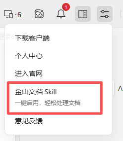
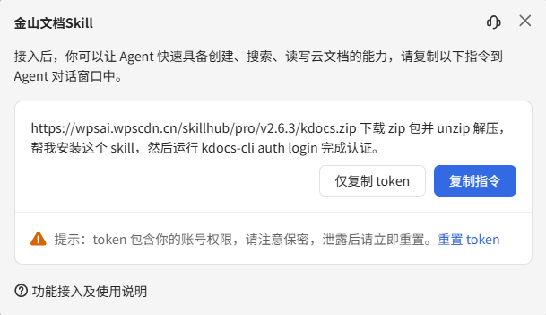

# dsh-kdocs-browser

DSH Web 侧栏插件：用本机 [kdocs-cli](https://www.kdocs.cn/latest) 浏览金山文档 / WPS 云文档，并把文件引用写进对话输入框。

通过 [dsh-better-sidebar](https://github.com/omdsh-dev/DSH-better-sidebar) 注册 Tab（`ctx.betterSidebar.registerTab`）。认证只走 kdocs-cli（系统钥匙串）。插件不保存 Cookie / Token，也不修改 DSH 源码。

侧栏只覆盖浏览、预览、部分编辑和引用。kdocs-cli 本身能力更广（云盘文件、智能文档、表格、多维表格、表单、演示、在线文字、PDF、知识库等）。装好用户技能 `kdocs` 后，Agent 在对话里直接调用同一套 CLI 读写云文档；侧栏引用的 `[kdocs]` 块给模型 `file_id` / 链接，便于接着用 CLI 打开对应文件。没有 Skill 时仍可浏览，模型不会自动走这套云文档工具。

## 能力

| 能力 | 说明 |
| --- | --- |
| 浏览 | 根目录列表、展开文件夹、分页 |
| 类型图标 | 智能文档 / 文字 / 表格 / 演示 / PDF / 文件夹 |
| 重命名 | 双击；保留后缀 |
| 移动 | 拖到文件夹或根目录投放区。文件走 `drive move-file`。云盘接口不能直接移动文件夹；插件在目标重建文件夹并迁入子项。源位置可能留下空文件夹（CLI 无删除） |
| 新建 | 新建文件夹；新建空 `.otl` |
| 预览 / 编辑 | 支持的文件做 Markdown 预览；`.otl` 用 `otl.insert-content`（`mode=replace`）保存 |
| 引用到问答 | 输入框插入 `@云文档/名称`。发送时若标记仍在，末尾追加短块 `[kdocs]`（`name` / `file_id` / `type` / `url`；划选另有 `excerpt`，有长度上限） |

## 环境要求

- `web` profile 上 `dsh web` 可正常启动。
- 已安装 [dsh-better-sidebar](https://github.com/omdsh-dev/DSH-better-sidebar)（peer）。右侧栏 `+` 菜单出现 **金山文档**。
- 本机 `kdocs-cli`（例如 `~/.local/bin/kdocs-cli`），并已 `kdocs-cli auth login`。
- 对话里让模型操作云文档时，必须把官方技能放到 DSH 用户技能目录 `~/.dsh/skills/kdocs/`（目录名与 `SKILL.md` 里的 `name: kdocs` 一致）。装到 Cursor 或其他目录时，DSH 会话读不到技能描述。**侧栏浏览不依赖 Skill。**

仅从源码构建时需要 Node.js >= 22。

## 安装

首次先装本插件，再按官方「金山文档 Skill」指令安装 CLI / Skill 并登录。侧栏缺依赖时会显示同一组命令。

### 1. 插件

```sh
dsh plugin --profile web add dsh-better-sidebar@latest
```

再安装本插件（仓库公开且已提交 `lib/` 后用 GitHub；开发用 `link:`）。Host 半区变更后重启 `dsh web`。

```sh
dsh plugin --profile web add github:OWNER/dsh-kdocs-browser
```

把 `OWNER` 换成仓库所有者。`dsh plugin add` 不会跑 `tsdown`；发布树必须包含 `lib/index.js` 和 `lib/client.js`。

本插件**尚未发布到 npm**。若本机还装着旧包名 `dsh-clouddoc-browser`，先 `dsh plugin --profile web remove dsh-clouddoc-browser` 再按新名安装。

### 2. kdocs-cli、Skill 与登录（官方）

登录 [金山文档](https://www.kdocs.cn)，点右上角侧栏，打开 **金山文档 Skill**（一键启用，轻松处理文档）：



弹窗里点 **复制指令**，贴到 **DSH Web 的对话**（不要贴到 Cursor 聊天，除非你只给 Cursor 用）。官方示例（zip 版本号会变，以弹窗为准）：

```
https://wpsai.wpscdn.cn/skillhub/pro/v2.6.3/kdocs.zip 下载 zip 包并 unzip 解压，帮我安装这个 skill，然后运行 kdocs-cli auth login 完成认证。
```



解压后必须把整个技能目录放到 DSH 能读的位置，目录名必须是 `kdocs`：

```text
~/.dsh/skills/kdocs/SKILL.md
~/.dsh/skills/kdocs/references/
~/.dsh/skills/kdocs/scripts/
```

Windows：`%USERPROFILE%\.dsh\skills\kdocs\SKILL.md`。若解压位置不在此目录，把整个 `kdocs` 技能文件夹移过去即可。

装好后自检：

```sh
ls ~/.dsh/skills/kdocs/SKILL.md
head -5 ~/.dsh/skills/kdocs/SKILL.md   # 应看到 name: kdocs
kdocs-cli version
```

WSL 请把 `~/.local/bin` 加入 `PATH`，否则 `dsh web` 可能找不到 CLI。

需要最新版时：再登录金山文档，从右侧栏 **金山文档 Skill** 取当前 zip 或安装指令。弹窗里的 **仅复制 token** 含账号权限，不要写进 README、聊天记录或 git；认证优先 `kdocs-cli auth login`。泄露则在该页重置 token。

没有 Skill 也可以在侧栏浏览；没有 CLI / 未登录时，本插件侧栏会出示与上文相同的命令。侧栏提示「未检测到 kdocs Skill」只表示 `~/.dsh/skills/kdocs/SKILL.md` 不存在，不挡浏览。

### 本地 clone（开发）

```sh
git clone https://github.com/OWNER/dsh-kdocs-browser.git
cd dsh-kdocs-browser
npm install
npm run build
dsh plugin --profile web add "link:$(pwd)"
```

重启 `dsh web`。侧栏没有新 Tab 时可用 `dsh --profile web --dump-config` 确认挂载。

卸载：

```sh
dsh plugin --profile web remove dsh-kdocs-browser
```

然后重启 `dsh web`。

## 使用

1. 启动 `dsh web`。右侧栏 `+` → **金山文档**。
2. 未装 CLI / 未登录时按面板提示处理。缺 Skill 时把官方技能放到 `~/.dsh/skills/kdocs/`；不挡浏览。
3. 单击文件夹展开，单击文件预览。`.otl` 用 **编辑 / 保存**。
4. 行尾 `@` 或 **引用到问答**。划选正文再 **加入问答** 会写入 `excerpt`。
5. 写完问题后发送。发送前删掉 `@云文档/…` 则不会追加 `[kdocs]`。

发送后用户气泡里仍可能出现 `[kdocs]` 短块。DSH 没有「输入框短、发出去更短」的双通道。

## 安全模型

- Host 以本地进程调用 `kdocs-cli`。Token 留在 CLI 钥匙串；不写进插件配置、不返回浏览器，也不得出现在 README 或 git 中。
- 访问云盘只通过 kdocs-cli，不复制 Cookie。
- 引用标记是普通草稿文本，不是官方 DSH mention。包装 `conversation.sendSession` 属于非官方扩展点（与 `dsh-tool-describe-image` 同类）。
- 不会把云盘挂进本地 Files 工作区。

## 已知限制

- 文件夹的 `move-file` / `copy-file` 会被云盘拒绝（`400100`）。重建 + 递归是变通；空文件夹需在网页删除。
- 侧栏内写入以 `.otl` 为主。文字 / 表格 / 演示仍以预览或浏览器打开为主。
- `@云文档/名称` 不是原生 mention 芯片。
- Agent PATH 不一定包含 `~/.local/bin`；浏览走 Host 进程 PATH，不是模型沙箱。
- 尚无设置卡（`settings.plugin.item`）；尚无测试 / typecheck 脚本。

## 许可证

本仓库以 [Apache-2.0](LICENSE) 授权。
